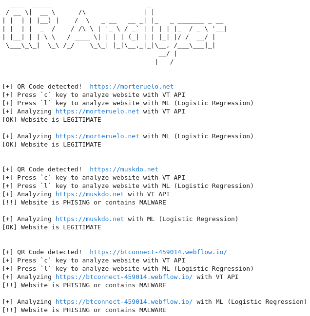

## QR Analyzer

### Description
This tool detects QR codes captured from a camera and then analyzes the URL. 

Developed by: Miguel de la Cal Bravo & Félix Paniagua Mérida.

### Requirements
QR Analyzer requires a webcam to capture the video and the following pip packages installed:
- opencv-python
- nest-asyncio
- pyfiglet
- vt-py
- scikit-learn
- nltk

Set the `VT_API` environment variable to your Virus Total API Key.

### Usage
Open the `qr_analyzer.ipynb` file with Jupyter Lab and execute .

Use your camera to scan a valid QR code and analyze the URL it contains.

After that, we will define a set of keys to enter and operate the program, when a QR code has been detected:`

- <kbd>c</kbd> : Analyze with VirusTotal API
- <kbd>l</kbd> : Analyze with ML (Logistic Regression)
- <kbd>q</kbd> : Close the camera and exit the program

Note that if the QR code has been previously scanned and analyzed in that QR Analyzer run, the result will be printed on screen without the need to analyze the website again.

#### Analysis with VirusTotal API
This function is used to analyze a URL detected from a QR code with VirusTotal API.

The URL will be reported as malware if three or more engines detect it as malicious or suspicious.

You can define your own functions to analyze a URL with different tools.

_NOTE: To use this feature you will need Internet connection and set your $VT_API environment variable to your API Key._

If the analysis reports that 3 or more antivirus engines have detected that the website as _malicious_ or _suspicious_, then a _"[!!] PHISING/MALWARE"_ message will be printed on screen in red. Otherwise, the website will be assumed to be safe and a _"[OK] LEGITIMATE"_ message will be displayed in green. 

#### Analysis with Machine Learning models
In this function we will use Logistic Regression to analyze a URL detected from a QR code.

The models have been trained previously and will be loaded as PKL files. You can find the training scripts in: https://github.com/filip7575/morteruelo

_NOTE: To use this feature you do not need Internet connection._

#### PoC - QR Analyzer
You can use QR codes files included in ```/qr_samples``` folder to test the tool.

